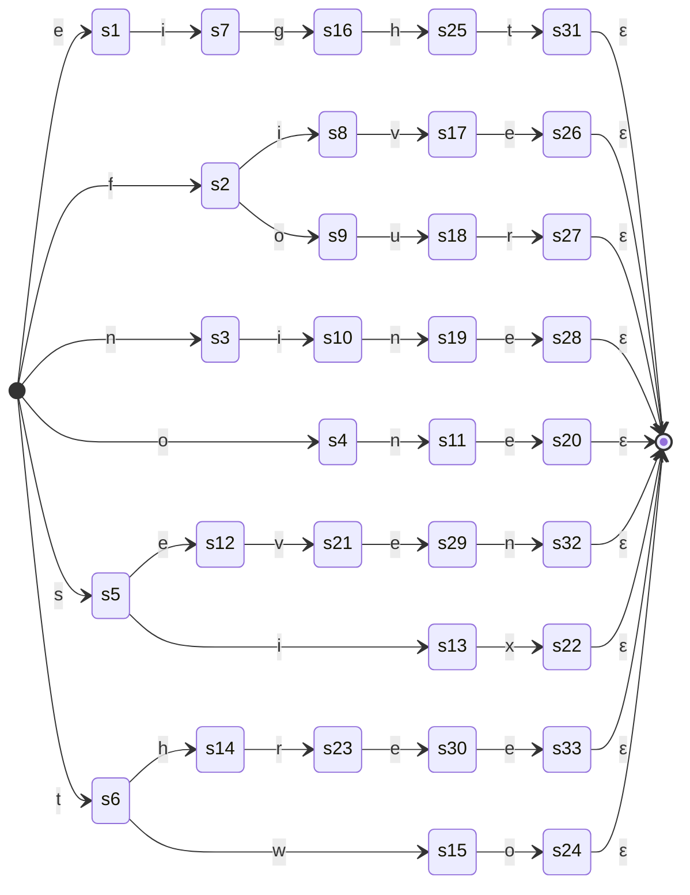
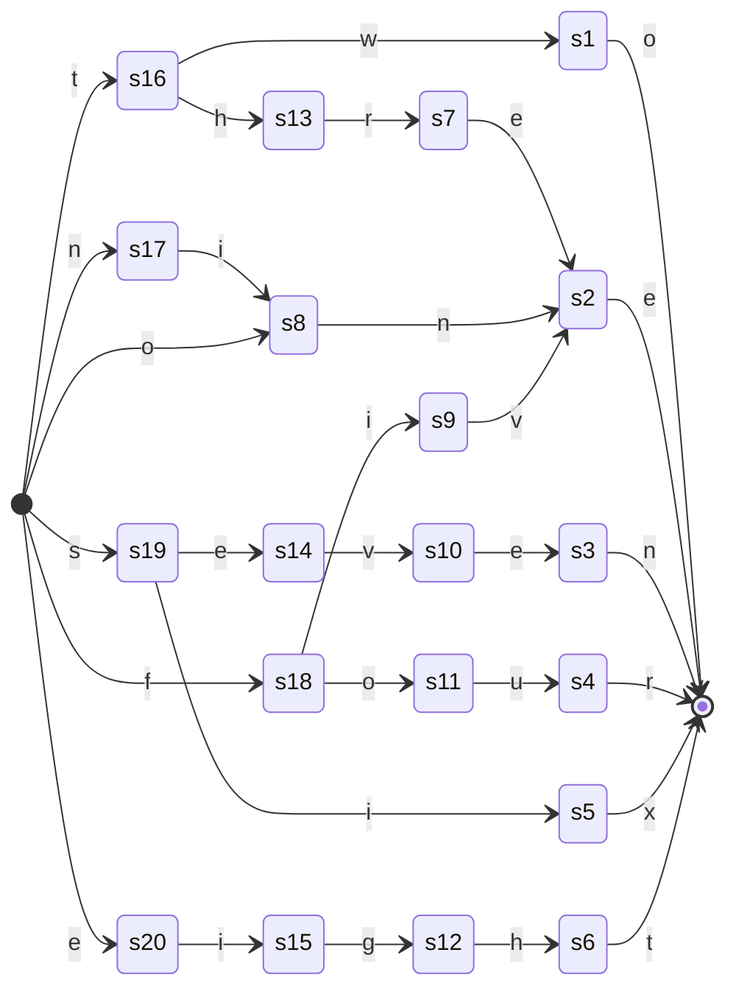
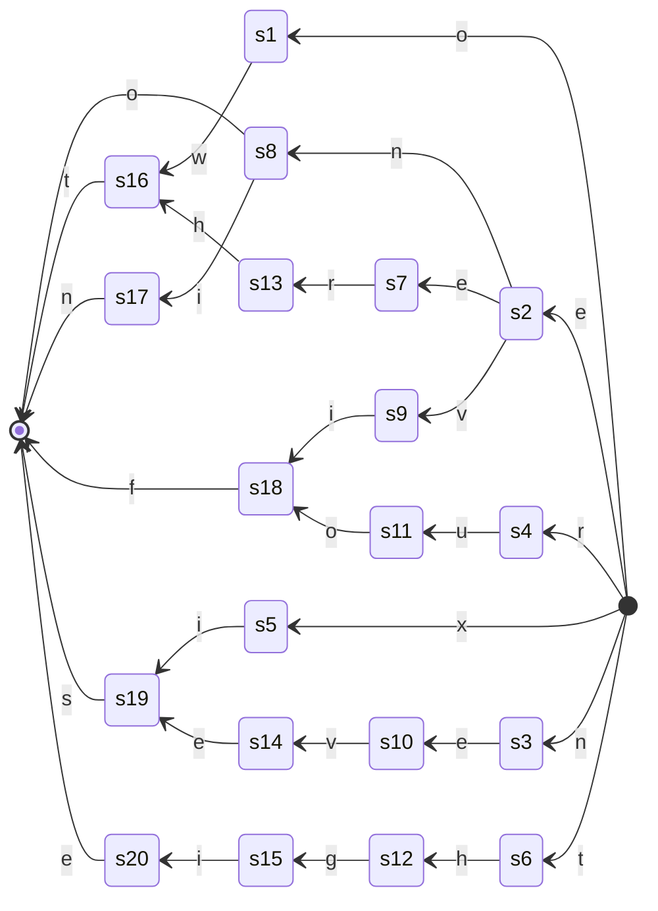

# day 1: scala
  scala attempt at day 1
## part 1
### strategy
1. attempted to use file inputting
2. hurdled too hard so just copy past and multi cursor'd into a `List(line*:String)`
3. in each line, grab all digits
  - first is cast to `Int` and `*10`
    * forgor for a bit that we needed to `*10`
  - second is cast to `Int`
  - add two values
  - update running total
4. answer failed so fixed `*10`
5. testing with supplied test
6. done

## part 2
### strategy
1. added pattern match for words
2. errors so debug with supplied test
3. works so reread, found input is same
4. had solution spoilt for me and realised i was only matching from left to right even while treating it like i was changing direction
5. attempting to find a pattern in the words
  * couldnt find any that held properly for all
  * created left to right state diagram
5. started reformatting file structure so i could include mermaid charts for each day
6. reformatted into new structure but still have some to do
7. need table for the data info
8. made table in this file
9. cleaned up `Main.scala`
10. *something something*
11. forgor `ruof`/`four`
12. omg we done it

### char acceptance state diagrams
* references:
  - https://github.com/JakeSteam/Mermaid/blob/main/state.md
  - https://mermaid.live/
  - https://blog.jakelee.co.uk/using-mermaid-for-diagrams-on-github/

<!-- ######################################################### -->
<ul>
  <!-- ======================================================= -->
  <!-- ======================================================= -->
  <li><h4>left-to-right alphabetical character acceptance</h4>

<i>[show / hide]</i>

  
</li>
  <!-- ======================================================= -->
  <!-- ======================================================= -->
  <li><h4>left-to-right alphabetical character acceptance 2</h4>

<i>[show / hide]</i>

  
</li>
  <!-- ======================================================= -->
  <!-- ======================================================= -->
  <li><h4>right-to-left alphabetical character acceptance</h4>

<i>[show / hide]</i>

  
</li>
  <!-- ======================================================= -->
  <!-- ======================================================= -->
</ul>
<!-- ######################################################### -->

### char details table

<table>
  <!-- ------ ------ ------ ------ ------ -->
  <!-- ------ ------ ------ ------ ------ -->
  <tr>
    <!-- ------ ------ ------ ------ -->
    <td>thinger</td>
    <!-- ------ ------ ------ ------ -->
    <td>aaaa</td>
    <td>bbbb</td>
    <td>cccc</td>
    <td>dddd</td>
    <td>eeee</td>
    <!-- ------ ------ ------ ------ -->
  </tr>
  <!-- ------ ------ ------ ------ ------ -->
  <!-- ------ ------ ------ ------ ------ -->
  <tr>
    <!-- ------ ------ ------ ------ -->
    <td>possible characters</td>
    <!-- ------ ------ ------ ------ -->
    <td>
      <ul>
        <!--  -->
        <!--  -->
        <li><code>e</code></li>
        <li><code>f</code></li>
        <li><code>g</code></li>
        <li><code>h</code></li>
        <li><code>i</code></li>
        <li><code>n</code></li>
        <li><code>o</code></li>
        <li><code>r</code></li>
        <li><code>s</code></li>
        <li><code>t</code></li>
        <li><code>u</code></li>
        <li><code>v</code></li>
        <li><code>w</code></li>
        <li><code>x</code></li>
      </ul>
    </td>
    <!-- ------ ------ ------ ------ -->
    <td>
      <code>List(e, f, g, h, i, n, o, r, s, t, u, v, w, x)</code>
    </td>
    <!-- ------ ------ ------ ------ -->
    <td>
      <code>/(e|f|g|h|i|n|o|r|s|t|u|v|w|x)/</code>
    </td>
    <!-- ------ ------ ------ ------ -->
  </tr>
  <!-- ------ ------ ------ ------ ------ -->
  <!-- ------ ------ ------ ------ ------ -->
  <tr>
    <!-- ------ ------ ------ ------ -->
    <td>crunchables</td>
    <!-- ------ ------ ------ ------ -->
    <td>

show/hide NFA1

| state | e | f | g | h | i | n | o | r | s | t | u | v | w | x |     ε     |   |
| ----- | - | - | - | - | - | - | - | - | - | - | - | - | - | - | --------- | - |
| start | s1| s2|   |   |   | s3| s4|   | s5| s6|   |   |   |   |   start   |   |
|    s1 |   |   |   |   | s7|   |   |   |   |   |   |   |   |   |      s1   |   |
|    s2 |   |   |   |   | s8|   | s9|   |   |   |   |   |   |   |      s2   |   |
|    s3 |   |   |   |   |s10|   |   |   |   |   |   |   |   |   |      s3   |   |
|    s4 |   |   |   |   |   |s11|   |   |   |   |   |   |   |   |      s4   |   |
|    s5 |s12|   |   |   |s13|   |   |   |   |   |   |   |   |   |      s5   |   |
|    s6 |   |   |   |s14|   |   |   |   |   |   |   |   |s15|   |      s6   |   |
|    s7 |   |   |s16|   |   |   |   |   |   |   |   |   |   |   |      s7   |   |
|    s8 |   |   |   |   |   |   |   |   |   |   |   |s17|   |   |      s8   |   |
|    s9 |   |   |   |   |   |   |   |   |   |   |s18|   |   |   |      s9   |   |
|   s10 |   |   |   |   |   |s19|   |   |   |   |   |   |   |   |     s10   |   |
|   s11 |s20|   |   |   |   |   |   |   |   |   |   |   |   |   |     s11   |   |
|   s12 |   |   |   |   |   |   |   |   |   |   |   |s21|   |   |     s12   |   |
|   s13 |   |   |   |   |   |   |   |   |   |   |   |   |   |s22|     s13   |   |
|   s14 |   |   |   |   |   |   |   |s23|   |   |   |   |   |   |     s14   |   |
|   s15 |   |   |   |   |   |   |s24|   |   |   |   |   |   |   |     s15   |   |
|   s16 |   |   |   |s25|   |   |   |   |   |   |   |   |   |   |     s16   |   |
|   s17 |s26|   |   |   |   |   |   |   |   |   |   |   |   |   |     s17   |   |
|   s18 |   |   |   |   |   |   |   |s27|   |   |   |   |   |   |     s18   |   |
|   s19 |s28|   |   |   |   |   |   |   |   |   |   |   |   |   |     s19   |   |
|   s20 |   |   |   |   |   |   |   |   |   |   |   |   |   |   | s20,finiš |   |
|   s21 |s29|   |   |   |   |   |   |   |   |   |   |   |   |   |     s21   |   |
|   s22 |   |   |   |   |   |   |   |   |   |   |   |   |   |   | s22,finiš |   |
|   s23 |s30|   |   |   |   |   |   |   |   |   |   |   |   |   |     s23   |   |
|   s24 |   |   |   |   |   |   |   |   |   |   |   |   |   |   | s24,finiš |   |
|   s25 |s31|   |   |   |   |   |   |   |   |   |   |   |   |   |     s25   |   |
|   s26 |   |   |   |   |   |   |   |   |   |   |   |   |   |   | s26,finiš |   |
|   s27 |   |   |   |   |   |   |   |   |   |   |   |   |   |   | s27,finiš |   |
|   s28 |   |   |   |   |   |   |   |   |   |   |   |   |   |   | s28,finiš |   |
|   s29 |s32|   |   |   |   |   |   |   |   |   |   |   |   |   |     s29   |   |
|   s30 |s33|   |   |   |   |   |   |   |   |   |   |   |   |   |     s30   |   |
|   s31 |   |   |   |   |   |   |   |   |   |   |   |   |   |   | s31,finiš |   |
|   s32 |   |   |   |   |   |   |   |   |   |   |   |   |   |   | s32,finiš |   |
|   s33 |   |   |   |   |   |   |   |   |   |   |   |   |   |   | s33,finiš |   |
| finiš |   |   |   |   |   |   |   |   |   |   |   |   |   |   |   finiš   | * |

    </td>
    <!-- ------ ------ ------ ------ -->
    <td>

show/hide e-close??

* :derpwut:
| state | ε-closure |
| ----- | --------- |
| start |   start   |
|    s1 |      s1   |
|    s2 |      s2   |
|    s3 |      s3   |
|    s4 |      s4   |
|    s5 |      s5   |
|    s6 |      s6   |
|    s7 |      s7   |
|    s8 |      s8   |
|    s9 |      s9   |
|   s10 |     s10   |
|   s11 |     s11   |
|   s12 |     s12   |
|   s13 |     s13   |
|   s14 |     s14   |
|   s15 |     s15   |
|   s16 |     s16   |
|   s17 |     s17   |
|   s18 |     s18   |
|   s19 |     s19   |
|   s20 | s20,finiš |
|   s21 |     s21   |
|   s22 | s22,finiš |
|   s23 |     s23   |
|   s24 | s24,finiš |
|   s25 |     s25   |
|   s26 | s26,finiš |
|   s27 | s27,finiš |
|   s28 | s28,finiš |
|   s29 |     s29   |
|   s30 |     s30   |
|   s31 | s31,finiš |
|   s32 | s32,finiš |
|   s33 | s33,finiš |
| finiš |   finiš   |

    </td>
    <!-- ------ ------ ------ ------ -->
  </tr>
  <!-- ------ ------ ------ ------ ------ -->
  <!-- ------ ------ ------ ------ ------ -->
  <tr>
    <!-- ------ ------ ------ ------ -->
    <td>character tables</td>
    <!-- ------ ------ ------ ------ -->
    <td>

show/hide character table 

| num | 0 | 1 | 2 | 3 | 4 | size |
| --- | - | - | - | - | - | ---- |
|  1  | o | n | e |...|...|   3  |
|  2  | t | w | o |...|...|   3  |
|  3  | t | h | r | e | e |   5  |
|  4  | f | o | u | r |...|   4  |
|  5  | f | i | v | e |...|   4  |
|  6  | s | i | x |...|...|   3  |
|  7  | s | e | v | e | n |   5  |
|  8  | e | i | g | h | t |   5  |
|  9  | n | i | n | e |...|   4  |

    </td>
    <!-- ------ ------ ------ ------ -->
    <td>

show/hide character table 

| num | 0 | 1 | 2 | 3 | 4 | size |
| --- | - | - | - | - | - | ---- |
|  1  |...|...| o | n | e |   3  |
|  2  |...|...| t | w | o |   3  |
|  3  | t | h | r | e | e |   5  |
|  4  |...| f | o | u | r |   4  |
|  5  |...| f | i | v | e |   4  |
|  6  |...|...| s | i | x |   3  |
|  7  | s | e | v | e | n |   5  |
|  8  | e | i | g | h | t |   5  |
|  9  |...| n | i | n | e |   4  |

    </td>
    <!-- ------ ------ ------ ------ -->
    <td>

show/hide character table LR-ASC 

| num | 0 | 1 | 2 | 3 | 4 | size |
| --- | - | - | - | - | - | ---- |
|  8  | e | i | g | h | t |   5  |
|  5  | f | i | v | e |...|   4  |
|  4  | f | o | u | r |...|   4  |
|  9  | n | i | n | e |...|   4  |
|  1  | o | n | e |...|...|   3  |
|  6  | s | i | x |...|...|   3  |
|  7  | s | e | v | e | n |   5  |
|  2  | t | w | o |...|...|   3  |
|  3  | t | h | r | e | e |   5  |

    </td>
    <!-- ------ ------ ------ ------ -->
    <td>

show/hide character table RL-ASC 

| num | 0 | 1 | 2 | 3 | 4 | size |
| --- | - | - | - | - | - | ---- |
|  3  | t | h | r | e | e |   5  |
|  9  |...| n | i | n | e |   4  |
|  1  |...|...| o | n | e |   3  |
|  5  |...| f | i | v | e |   4  |
|  7  | s | e | v | e | n |   5  |
|  2  |...|...| t | w | o |   3  |
|  4  |...| f | o | u | r |   4  |
|  8  | e | i | g | h | t |   5  |
|  6  |...|...| s | i | x |   3  |

    </td>
    <!-- ------ ------ ------ ------ -->
  </tr>
  <!-- ------ ------ ------ ------ ------ -->
  <tr>
    <!-- ------ ------ ------ ------ -->
    <td>
      Bregular expressionistic
    </td>
    <!-- ------ ------ ------ ------ -->
    <td>
      <code>(owt)|(e((erht)|(n((in)|o))|(vif)))|(((neve)|(xi))s)|(thgie)</code>
    </td>
    <!-- ------ ------ ------ ------ -->
    <td>
      <code>owt|e(erht|n(in|o))|vif|(neve|xi)s|thgie|[1-9]</code>
    </td>
    <!-- ------ ------ ------ ------ -->
    <td>
      <code>t(wo|hree)|(ni|o)ne|s(even|ix)|f(ive|our)|eight</code>
    </td>
    <!-- ------ ------ ------ ------ -->
    <td>
      <code>t(wo|hree)|(ni|o)ne|s(even|ix)|f(ive|our)|eight|[1-9]</code>
    </td>
    <!-- ------ ------ ------ ------ -->
  </tr>
  <!-- ------ ------ ------ ------ ------ -->
</table>

