# day 5: scala
  scala attempt at day 5
## Quick links
### REPO NAV
* [`README`](./README.md)
* [`projectChangesAndNotes`](./projectChangesAndNotes.md)
* [`dayDocMaker`](./dayDocMaker.md)
### DAY FILES
* [day's AoC page](https://adventofcode.com/2023/day/5)
* [Input file](https://adventofcode.com/2023/day/5/input)
* [day's scala file](../../src/main/scala/day5.scala)
## part 1
### strategy
1. kinda just yoinks from our day4 solution,
2. just grab the info for a given source then BST them?
3. may benefit from a parse tree for understanding the things
4. they forcing us to use longs :blobsob:
5. what if we just make a parser lmao?
    1. parser means we get things to use later on to speed things up
    2. means more time spent on earlier days though
6. SO WHADAWE GOT
    1. need some defineables
    2. just keep them as they were then redefine later we can tree it
        * Input
          - `seedExp ~ MapExpList`
        * seedExp
          - `seedDeclaration`
        * seedDeclaraction
          - `"Seed:" ~> (Integer)+`
        * MapExpList
          - `(Mapping)+`
        * Mapping
          - `MapSignature ~ (mappingDeclaration)+`
        * MapSignature
          - `source ~ ("-to-" ~> destination <~ "map:")`
        * mappingDeclaration
          - `Integer ~ Integer ~ Integer`

```mermaid
classDiagram
    %% ===================================
    %% ===================================
    %% === supers

    class FunLangNode

    class Type
    
    class Identifier{
        String
    }

    %% ===================================
    %% ===================================
    %% === super children

    class Exp
    FunLangNode <|-- Exp

    class Program {
        Program(Exp)
    }
    FunLangNode <|-- Program

    class Idn{
        +Identifier idn
    }
    FunLangNode <|-- Idn
    Identifier <.. Idn

    class Defn {
        Defn(Vector[IdnDef], Exp)
    }
    FunLangNode <|-- Defn

    %% ===================================
    %% ===================================
    %% === identifier branch branch

    class IdnDef
    Exp <|-- IdnDef
    Idn <.. IdnDef

    class IdnUse
    Exp <|-- IdnUse
    Idn <.. IdnUse

    %% ===================================
    %% ===================================
    %% === Type branch

    class BoolType
    Type <|-- BoolType

    class FunType{
        FunType(Type,Type)
    }
    Type <|-- FunType

    class IntType
    Type <|-- IntType

    class ListType{
        ListType(Type)
    }
    Type <|-- ListType

    class TupleType{
        TupleType(Vector[Type])
    }
    Type <|-- TupleType

    class UnknownType
    Type <|-- UnknownType

    %% ===================================
    %% ===================================
    %% === Exp branch

    class WithDoExp{
        WithDoExp(Vector[Defn],Exp)
    }
    Exp <|-- WithDoExp
    Defn <.. WithDoExp

    
    class AppExp{
        AppExp(Exp,Exp)
    }
    Exp <|-- AppExp

     
    class LamExp{
        LamExp(Vector[IdnDef],Exp)
    }
    Exp <|-- LamExp
    IdnDef <.. LamExp

    
    class TupleExp{
        TupleExp(Vector[Exp])
    }
    Exp <|-- TupleExp

    
    class ListExp{
        ListExp(Vector[Exp])
    }
    Exp <|-- ListExp

    
    class BoolExp{
        BoolExp(Boolean)
    }
    Exp <|-- BoolExp

    
    class EqualExp{
        EqualExp(Exp,Exp)
    }
    Exp <|-- EqualExp

    
    class IfExp{
        IfExp(Exp,Exp,Exp)
    }
    Exp <|-- IfExp

    
    class IntExp{
        IntExp(Int)
    }
    Exp <|-- IntExp

    
    class LessExp{
        LessExp(Exp,Exp)
    }
    Exp <|-- LessExp

    class MinusExp{
        MinusExp(Exp,Exp)
    }
    Exp <|-- MinusExp

    
    class PlusExp{
        PlusExp(Exp,Exp)
    }
    Exp <|-- PlusExp

    
    class SlashExp{
        SlashExp(Exp,Exp)
    }
    Exp <|-- SlashExp

    
    class StarExp{
        StarExp(Exp,Exp)
    }
    Exp <|-- StarExp

    
    class ConsExp{
        ConsExp(Exp,Exp)
    }
    Exp <|-- ConsExp

    %% ===================================
    %% ===================================
```

<i>show/hide <code>FunLangTree</code></i>

7. need to build the tests documents for this 
    1. build out what the expectations are so we know what to aim for
8. we built the tree now deal with it
9. removed the unecessary translations
10. each mapping needs a min and max for the source and destination
    1. we then need to match the min of when it's source or destination for the non seed/location
11. bigggg brain:
    1. just get seed count
        * dont even need to check minimum/maximum possible number
        * but if we wanted to we just make a table of all the numbers and all their end range numbers, then loop all and check smallest/biggest
    2. transform the seeds by the mapping
        1. use to check if we're within a particular mapping, then our offset in, is what we get of destination
        2. stash what idn state we're in of the current transform
    3. then at the end we check which we are

## part 2
### todo thingables
1. need to implement `MapRangeTree.buildTree`
    1. just lazy pairs up all items in the vector till we have single node
    2. sorting could happen here if we wanted to do merging nodes
2. need to implement `MapRangeTree.applyTransform`
    1. takes in `MapExp`
    2. spits out `DividedRange` node with the exp applied

### strategy
1. bruh
2. idk just loop the seeds and try see if any transform has cross over at all
3. we tried, and it'ss a scam. there's partial portions in ranges
4. new idea:
    1. what if we stash how it's splitting each time
    2. so it's a seed range node
    3. then if it's partially in a list, it splits into two seed range nodes
    4. each time a range is partially in the range, the sub range gets put into its own splitted thing
5. we whiteboarded some things and figured out the flow of it
6. the whiteboard notes:
    1. tree up sseed ranges
    2. create vector for seed ranges (leave new range, make leftover range)?? (maybe not needed)
    3. each trransition (e.g. seed to soil)
        1. each map range
            1. access range it applies or **ranges**
                1. update/split as needed with new ~~state label~~ *transform count*
                2. update ~~state labels~~ transform counts that arent in ranges (when the range stays the same)
    4. ~~ends at state "location" for smallest range~~ ends when done all mappings
7. using number of transforms instead of state label as it prevents us needing to compare strings
8. since we're using a binary tree we could just perform swaps to reorganise it then do merge on all the ones that are aligned to each other
9. building the tree:
    1. we just turrn them into rangess
    2. then we pair up the ranges into divided range nodes
    3. then pair the divided range nodes till we have one node
    4. then process
10. should be working on divided nodes only, never on specific range nodes
11. tail recursive fix involves moving to giving parent node + direction instead of child node??
12. junk idea but worth mentioning
    1. if we wanted to keep track of history/corresponding seed
        * each seed range could be an option in an array of `seedRangeCount` length
        * starting them as `SpecifiedRange` nodes for each
        * then as the algorithm progresses, their children/index is updated to either be one node or the nodes in that index's tree is updated
        * thiss then preserves the index in our seed list to reference later to say what it is from
    2. if we wanted to keep a history of the changes
        * we use the `new Array[RangeNode](seedRangeCount)` idea
        * then we also add to `RangeNode` a vector treated like a stack
        * thiss is pushed to whenever there's a change made for that node of:
            * *the node changes from a `SpecifiedRange` to `DividedRange`*
            * OR *the `SpecifiedRange` node is changed to a new `SpecifiedRange`*
13. now for the apply transform method implementation notes
    1. when called on `DividedRange` node
    2. check left for `DividedRange`
        1. when `DividedRange`: recurse on left, replacing left with result
        2. otherwise: process left's update
    3. check right for `DividedRange`
        1. when `DividedRange`: recurse on right, replacing right with result
        2. otherwise: process right's update
14. what if we move the methods into handlepart2 method so we have access to the includeDebuggingInformation

15. welp we cooked it captain, we need to invert the way we're processing things to use the whole map list and check it couldnt update before going to the next item in the tree
16. pain, we were using the wrong seeds, it works now, and very overengineered.
    * enjoy the spaghetti @ (anyone interested in how this works)

