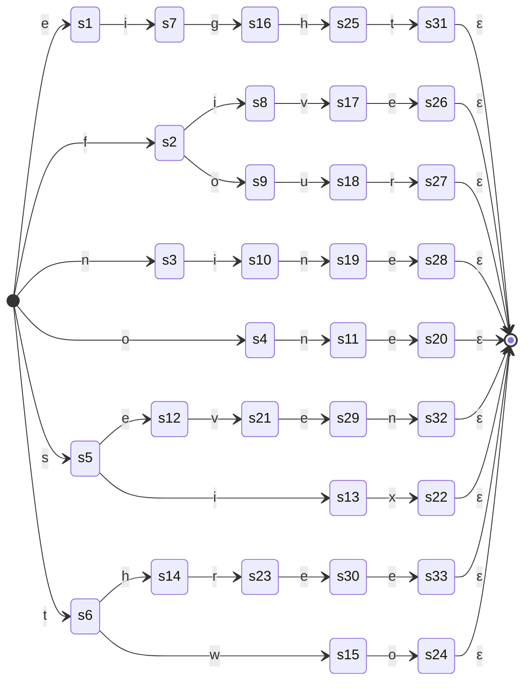

# day 1: scala
  scala attempt at day 1
## part 1
### strategy
1. attempted to use file inputting
2. hurdled too hard so just copy past and multi cursor'd into a `List(line*:String)`
3. in each line, grab all digits
  - first is cast to `Int` and `*10`
    * forgor for a bit that we needed to `*10`
  - second is cast to `Int`
  - add two values
  - update running total
4. answer failed so fixed `*10`
5. testing with supplied test
6. done

## part 2
### strategy
1. added pattern match for words
2. errors so debug with supplied test
3. works so reread, found input is same
4. had solution spoilt for me and realised i was only matching from left to right even while treating it like i was changing direction
5. attempting to find a pattern in the words
  * couldnt find any that held properly for all
  * created left to right state diagram
5. started reformatting file structure so i could include mermaid charts for each day
6. reformatted into new structure but still have some to do
7. need table for the data info

### char acceptance state diagrams
* references:
  - https://github.com/JakeSteam/Mermaid/blob/main/state.md
  - https://mermaid.live/
  - https://blog.jakelee.co.uk/using-mermaid-for-diagrams-on-github/

### char details table

<!-- TODO -->